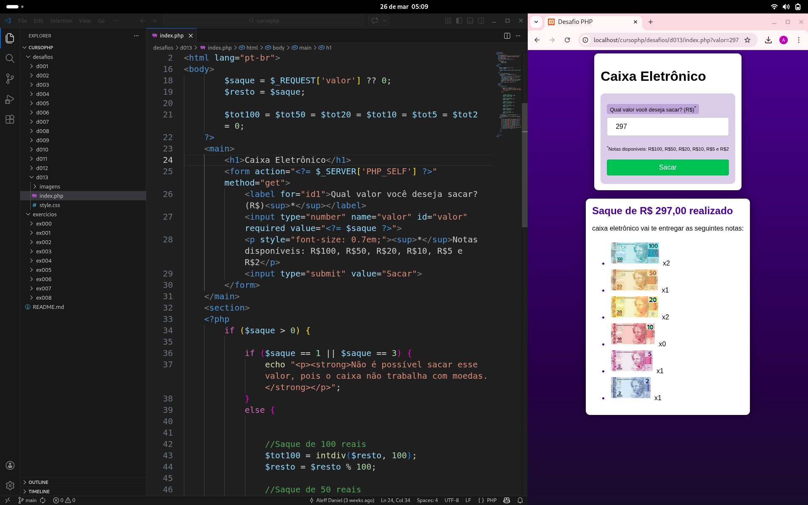
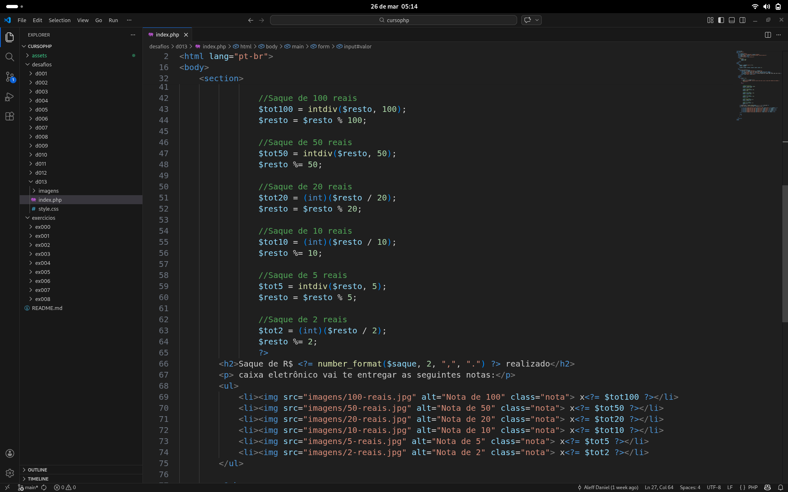

# Sistema Web em PHP

Este projeto foi desenvolvido durante meus estudos de PHP, com o objetivo de praticar conceitos fundamentais de desenvolvimento web, integração entre front-end e back-end e manipulação de dados através de formulários.

---

## Funcionalidades

- Manipulação de formulários
- Validação de dados
- Operações matemáticas dinâmicas
- Exibição de resultados em tempo real
- Tratamento de erros (ex: divisão por zero)

---

## Tecnologias utilizadas

- PHP
- HTML
- CSS

---

## Conceitos aplicados

- Estruturas condicionais (if/else)
- Manipulação de variáveis
- Integração entre frontend e backend
- Organização de código
- Lógica de programação

---

## Demonstração

### Interface do sistema

### Código da aplicação

---
Projeto voltado para aprendizado.
